# session-continuity

When an agent hits its context limit, the built-in fix is a summary, and a summary keeps the conclusions while dropping the decisions, paths, and dead ends behind them. session-continuity is a specified checkpoint file, hooks that catch the compaction you did not see coming, and a linter that checks the file. Two scripts wire it into Claude Code.

The format and protocols work on any harness that reads files.




## Quick start

```bash
git clone https://github.com/eliferres/session-continuity.git
cd session-continuity
python3 tools/checkpoint_lint.py examples/*.md   # zero dependencies, Python 3.9+
```

Copy `CHECKPOINT-TEMPLATE.md` into your project as `CHECKPOINT.md`, paste
the contract below into `CLAUDE.md` or your system prompt, and run the
linter before you trust a checkpoint. Hooks are optional; see
[docs/hooks.md](docs/hooks.md).

## The four ideas

**Depth beats summary.** A summary answers "what happened". A resume
needs "what is true, what was decided and why, and what not to try
again". The [worked example](examples/2026-03-11-orders-dashboard-migration.md)
is the argument: one paragraph in it records a connection-pool trap that
cost two hours, and the next session skips those two hours entirely.

**Rewrite in full, never append.** An appended checkpoint accumulates
contradictions and the reader cannot tell which line is current.
Rewriting forces a pass over the whole state, which is where you notice
that the thing you called done is actually blocked.

**Read it all, then verify, then continue.** A partial read reproduces
the thin-summary failure the checkpoint exists to prevent. And a
checkpoint is a claim, not a fact: anything you are about to act on gets
checked against the live source first, because the world moved while you
were gone.

**Absolute everything.** Absolute dates, verbatim paths, real commands,
observed output. Every paraphrase is a small compaction, and compaction
is the thing that broke.

## The checkpoint file anatomy, verbatim

This is the wire format, copied from [docs/anatomy.md](docs/anatomy.md)
(that file is the source of truth):

````markdown
```markdown
---
type: session-checkpoint
updated: YYYY-MM-DD          # absolute, always; the linter rejects anything else
---

# Checkpoint — <one-line arc name>

<Two or three lines telling the reader to read the whole file before
acting, and that everything below is exact rather than remembered.>

## Objective
The outcome the work serves, in one or two lines. Not the current task —
the reason the task is worth doing.

## State
Per workstream: done and verified / in flight / blocked. Exact files,
commands, and observed output. A workstream with no evidence behind it is
"in flight", never "done".

## Decisions and why
Every ruling made, each with the reasoning that produced it, including the
alternatives rejected. The conclusion alone invites relitigation; the
argument is what closes the question.

## Open threads
Next actions in priority order, each concrete enough to act on cold.
Blocked items name the blocker and what clears it.

## Gotchas and dead ends
Approaches tried and rejected with a one-line why each, traps hit and
their fix, and anything that looks wrong but is correct.
```

## The five rules that make it work

1. **Absolute dates, never relative ones.** "Fixed yesterday" is
   unreadable a week later. `2026-03-11` is readable forever.
2. **Verbatim specifics.** Paths, commands, identifiers, numbers, and
   error strings are copied, not paraphrased. Paraphrase is the exact
   thing compaction already does, and it is what loses the state.
3. **Written for zero context.** Assume the reader has never seen the
   project. If a sentence only makes sense to someone who was there, it
   does not belong in a checkpoint.
4. **Every section survives, even when empty-ish.** A missing section
   reads as forgotten; a section saying "none" reads as answered.
5. **Depth, not bulk.** Write what a fresh session cannot re-derive from
   the repository and its history. Never paste transcripts.

## Required sections

`Objective`, `State`, `Decisions`, `Open threads`, `Gotchas`. The linter
matches on prefix, so `## Decisions and why` and `## Gotchas and dead ends`
satisfy the requirement while reading like prose.
````

## The protocols, in one paragraph each

**Write** at session end, when the context ceiling is close, before any
deliberate compaction, and after each milestone: a checkpoint several
ships behind is worse than none, because it is confidently wrong. Rewrite
the whole file, drop a dated copy in `.checkpoints/`, and read the file
back rather than trusting the write.

**Read** the checkpoint in full first, in one read of a known path. Follow
its references on demand, verify what you are about to act on, restate a
short recap so a human can catch a wrong inheritance early, then continue
using the real specifics. Missing or stale checkpoint: say so and fall
back to the dated copies, never guess.

Both are spelled out in [docs/protocol.md](docs/protocol.md).

## What is in the box

| Path | Role |
|---|---|
| `CHECKPOINT-TEMPLATE.md` | The blank, with per-section hints. Copy it into your project. |
| `docs/anatomy.md` | The file format specification. Source of truth for the block above. |
| `docs/protocol.md` | When and how to write a checkpoint; how to rehydrate from one. |
| `docs/hooks.md` | Wiring the two hooks into Claude Code settings. Optional. |
| `examples/` | One realistic filled checkpoint, mid-migration, that passes the linter. |
| `hooks/precompact-checkpoint.sh` | Archives state and stamps the compaction before context is compressed. |
| `hooks/sessionstart-resume.sh` | Announces `RESUME AVAILABLE`, warns when the checkpoint is behind. |
| `tools/checkpoint_lint.py` | Shape linter, stdlib only. |
| `tests/test_checkpoint_lint.py` | Real fixture files on disk, no mocks. |

## What the linter enforces

Four checks, each guarding a way a checkpoint actually fails:

1. Every required section is present. A missing section is a category of
   state nobody wrote down.
2. No required section is empty. Empty headings are the most common way a
   checkpoint looks complete and restores nothing.
3. `updated:` is an absolute `YYYY-MM-DD` date, and no relative time word
   ("yesterday", "last week") appears in the prose. Code fences are
   exempt: `git log --since=yesterday` is a command, not a claim.
4. Length sanity, advisory only: a three-line checkpoint of a long
   session is a summary wearing a checkpoint's headings.

CI runs the tests on three Python versions and then lints the shipped
example and template, so it can never ship a file its own linter
rejects.

## Why not just let it compact

Compaction optimizes for fitting, and what fits is conclusions. The
expensive parts of a session are the parts with no artifact: the
alternative you rejected and why, the hour lost to a trap, the number you
checked and found wrong. None of it survives a summary, all of it is
cheap to write down, and writing it down is what turns a long project
into one continuous session rather than a series of confident restarts.

The companion repo [agent-memory-vault](https://github.com/eliferres/agent-memory-vault)
covers the other half (durable cross-project memory) and ships a
minimal checkpoint file as one note in its vault; this repo is the deep
version of that one file.

## Limitations

- A checkpoint is only as good as the discipline of the agent writing
  it. Nothing here can make a lazy checkpoint honest, and a confident
  wrong checkpoint is worse than none.
- The linter checks shape, not substance. "Decisions" full of decisions
  without their reasoning passes cleanly.
- The hooks are Claude Code specific. Other harnesses need the protocol
  in the system prompt and a manual checkpoint step.
- The PreCompact hook cannot write the checkpoint, only preserve and
  stamp what already exists. The judgment is the product, and it comes
  from the agent.
- Single project, single front door. Parallel sessions writing the same
  `CHECKPOINT.md` need the dated archive to stay honest, and merging two
  live arcs is still a human job.

## License

MIT
